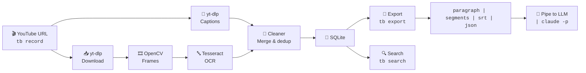

# TubeBrain

**Ask any question about any YouTube video — from your terminal.**

---

## The Problem

You watch a YouTube video to learn something. An hour later, you forgot half of it. You could take notes — but that's slow and you still have to watch the whole thing.

YouTube has auto-captions — but they're messy. They repeat words, overlap sentences, and build progressive phrases like:
```
00:00  "Most people don't realize that"
00:01  "Most people don't realize that you can"
00:02  "Most people don't realize that you can make"
```
Reading them is painful. Copying them is worse.

## The Solution

TubeBrain downloads the captions, cleans them up (removes the repeats, merges overlapping sentences), and gives you clean text you can pipe directly into an LLM.

So instead of watching, you just **ask**.

```bash
# Download a video
tb record https://www.youtube.com/shorts/liOQbZln9xw

# Ask anything about it
tb export 78079f52 --fmt paragraph | claude -p "what repos are mentioned and who to sell them to"
```

No watching. No copy-paste. No API keys. Just questions and answers.

---

## Quick example

```bash
# 1. Download a video
$ tb record https://www.youtube.com/shorts/liOQbZln9xw
Created run: 78079f52
  Title:    6 github repos that make you money with AI
  Duration: 0:52
  Captions: 70 segments

# 2. Summarize the video
$ tb export 78079f52 --fmt paragraph | claude -p "summarize this"
6 Free GitHub Repos for AI Side Income: AutoClip MVP (creators/streamers),
Remotion (media companies/marketing), Open Hands (SMBs), Persona Live (AI
influencers), Red Ink (Asian e-commerce), Mubu AI Novel (publishers)...

# 3. Or ask specific questions
$ tb export 78079f52 --fmt paragraph | claude -p "what repos are mentioned and who to sell them to"

| Repo              | What it does                                  | Who to sell to                          |
|-------------------|-----------------------------------------------|------------------------------------------|
| AutoClip MVP      | Auto video clip cutting & highlight extraction | Creators, live streamers                 |
| Remotion          | Template-based video automation               | Media companies, marketing firms         |
| Open Hands        | Autonomous AI software developer              | Small & medium businesses                |
| Persona Live      | Real-time AI portrait/avatar for live streams | Brands wanting AI influencers            |
| Red Ink           | Text & image gen for Red Note                 | E-commerce sellers on Asian social nets  |
| Mubu AI Novel     | Mass AI book/plot/novel writing               | Publishing platforms                     |

# 4. Or get subtitles instead
$ tb export 78079f52 --fmt srt -o captions.srt
Written: captions.srt (1,396 chars)
```

---

## What you get

| Format | What it is |
|---|---|
| `paragraph` | One clean block of text — best for LLMs |
| `segments` | Paragraphs with timestamps — best for reading |
| `srt` | Standard subtitle file — works in any video player |
| `json` | Structured data — best for programs and RAG |

All formats include on-screen text (OCR) if you ran `tb process`.

---

## Install

### Requirements

- **Python 3.11+**
- **Tesseract OCR** (only if you want on-screen text)
- **No API keys** — captions come from YouTube directly

### Steps

**1. Clone and install:**
```bash
git clone https://github.com/maheswaran-hub/tubebrain
cd tubebrain
uv pip install -e .
```

**2. Install Tesseract (optional, for on-screen text):**

Windows:
```powershell
winget install --id UB-Mannheim.TesseractOCR --force --accept-package-agreements --accept-source-agreements
```

macOS: `brew install tesseract`
Ubuntu: `sudo apt install tesseract-ocr`

**3. Verify:**
```bash
tb doctor
```
This checks that Python, yt-dlp, OpenCV, Tesseract, and the `tb` CLI itself are all installed and working. Run it any time something isn't working — it'll tell you exactly what's missing.

---

## How to use it

TubeBrain has a simple 3-step workflow:

**1. Record** — download a video and grab its auto-captions
```bash
tb record https://www.youtube.com/watch?v=VIDEO_ID
```
This gives you a `run_id` (e.g. `abc12345`). Captions are stored locally in SQLite — no API keys needed.

**2. Export** — get clean text in your preferred format
```bash
tb export abc12345 --fmt paragraph   # one clean paragraph
tb export abc12345 --fmt segments   # timestamped paragraphs
tb export abc12345 --fmt srt        # subtitles
tb export abc12345 --fmt json       # structured data
```

**3. Pipe to an LLM** — ask questions, summarize, extract anything
```bash
tb export abc12345 --fmt paragraph | claude -p "summarize this"
tb export abc12345 --fmt paragraph | claude -p "what tools are mentioned?"
tb export abc12345 --fmt paragraph | claude -p "list all the steps mentioned"
```

That's it. No watching. No copy-paste. No captions to read.

> **Tip:** If a video has on-screen text you also want (code, diagrams, slides), run `tb process abc12345 --fps 1` after recording to extract frames and run OCR.

---

## Usage

### Download a video
```bash
tb record https://www.youtube.com/watch?v=VIDEO_ID
```

Output:
```
Created run: abc12345
  Title:    Kubernetes Helm Tutorial
  Duration: 14:32
  Captions: 245 segments
```

### Optional: extract on-screen text
```bash
# Frames + OCR (slow for long videos)
tb process abc12345 --fps 1
```

### Export in any format

```bash
# One clean paragraph (best for piping to an LLM)
tb export abc12345 --fmt paragraph

# Timestamped segments (default)
tb export abc12345

# SRT subtitles
tb export abc12345 --fmt srt -o captions.srt

# JSON for programmatic use
tb export abc12345 --fmt json -o captions.json
```

### Pipe to an LLM

The basic pipe works, but the LLM commands below hide it entirely — no need to remember the `claude -p` syntax.

```bash
# Summarize (built-in)
tb summarize abc12345

# Ask a question (built-in)
tb ask abc12345 "what repos are mentioned?"

# Interactive chat
tb chat abc12345
# > you: what's the first repo?
# > claude: ...
# > you: (empty line to quit)

# Or do the pipe yourself
tb export abc12345 --fmt paragraph | claude -p "what tools are mentioned?"
```

### Process a whole playlist

Just paste a playlist URL — TubeBrain detects it and downloads every video:
```bash
tb record https://www.youtube.com/playlist?list=PLAYLIST_ID
# (1/12) Downloading: https://...
# (2/12) Downloading: https://...
# ...
```

### Batch export

Export every video in one go:
```bash
tb export --all --fmt paragraph -o library/
# Wrote: library/78079f52.txt
# Wrote: library/6f96b1b0.txt
# ...
```

### Translation and audio

```bash
# Export captions in a different language (falls back to original if not available)
tb export abc12345 --lang es

# Extract audio as MP3
tb export abc12345 --audio
```

### Generate a mind map

Turn a video into a structured mind map (uses Claude to organize topics):

```bash
# Default: Mermaid mind map (paste into mermaid.live or VS Code)
tb mindmap abc12345

# Nested markdown bullets (Obsidian, any markdown editor)
tb mindmap abc12345 --fmt markdown

# JSON tree (for programmatic use)
tb mindmap abc12345 --fmt json

# Write to a file
tb mindmap abc12345 -o mindmap.mmd
```

Output is valid Mermaid mind map syntax — paste it into any Mermaid renderer
that supports `mindmap` (mermaid.live, VS Code with Mermaid extension).

### Search
```bash
tb search "machine learning"           # all videos
tb search "API" -r abc12345            # one video
tb search "chart" -t 60-180            # time range
tb search "intro" --kind transcript    # captions only
```

### Manage
```bash
tb runs                # list all videos
tb inspect abc12345    # see details + raw captions
tb delete abc12345     # remove a video
```

---

## All commands

| Command | What it does |
|---|---|
| `tb record <url>` | Download a YouTube video (or playlist) + captions |
| `tb process <run_id>` | Extract frames + OCR (optional) |
| `tb export <run_id> --fmt <paragraph\|segments\|srt\|json>` | Export clean captions |
| `tb export <run_id> --lang es` | Export captions in another language |
| `tb export <run_id> --audio` | Extract MP3 audio |
| `tb export --all` | Export every video |
| `tb summarize <run_id>` | Summarize a video with Claude |
| `tb ask <run_id> "..."` | Ask Claude a question |
| `tb chat <run_id>` | Interactive Q&A with a video |
| `tb mindmap <run_id>` | Generate a mind map of a video |
| `tb search <text>` | Search extracted text |
| `tb runs` | List all videos |
| `tb inspect <run_id>` | See one video's details |
| `tb delete <run_id>` | Delete a video |
| `tb doctor` | Check dependencies |

---

## How it works



### The caption cleaning pipeline

YouTube auto-captions have three common noise patterns:

1. **Progressive sentence building** — each segment adds a few words:
   ```
   00:00:00  "Most people don't realize that"
   00:00:01  "Most people don't realize that you can"
   00:00:02  "Most people don't realize that you can make"
   ```
   → After cleaning: `Most people don't realize that you can make…`

2. **Self-repeating phrases** — same line 2-3x in one segment:
   ```
   "here's how here's how here's how to do it"
   ```
   → After cleaning: `here's how to do it`

3. **Adjacent duplicates** — same word twice:
   ```
   "the the cat sat"
   ```
   → After cleaning: `the cat sat`

The cleaner handles all three before any export.

---

## Where is everything stored?

```
tubebrain/
└── runs/
    ├── tubebrain.db              ← searchable captions + OCR
    └── abc12345/                 ← one folder per video
        ├── Video Title.mp4
        ├── captions.json
        └── frames/               ← only if you ran `tb process`
```

---

## Tips

- **The killer use case is the pipe.** `tb export ... | claude -p "..."` is faster than watching.
- **Captions are gold.** Most YouTube videos have free auto-captions. OCR is bonus.
- **`--fps 0.5` for hour-long videos** — captures change without bloating storage.
- **Use `-t` to scope searches** — `-t 0-60` searches only the first minute.
- **Back up `runs/`** — your knowledge base travels with you.

---

## License

MIT

---

Built for anyone who watches YouTube to learn — and wants to *ask* instead of *watch*.
