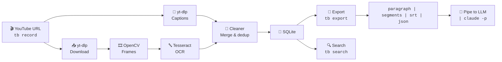

# TubeBrain

**TubeBrain turns YouTube videos into text you can search, summarize, and ask questions about — from your terminal.**

You give it a YouTube URL. It downloads the video and the captions, cleans up the messy auto-generated text, and stores it locally. Then you can:

- Search across all your videos
- Export clean text in 4 formats
- Ask Claude to summarize, answer questions, or build a mind map
- Extract the audio as MP3
- Process whole playlists at once

No API keys. No watching. No copy-paste from captions.

---

## The problem

You watch a YouTube video to learn something. A few hours later, you forgot half of it.

YouTube has auto-captions, but they're messy:

```
00:00  "Most people don't realize that"
00:01  "Most people don't realize that you can"
00:02  "Most people don't realize that you can make"
```

You don't want to take notes. You don't want to read 200 messy caption segments. You just want to **ask the video a question** and get a real answer.

## What TubeBrain does

1. **Downloads** the YouTube video and its auto-captions
2. **Cleans** the captions (merges repeats, removes duplicates, strips noise)
3. **Stores** everything locally in SQLite — no API keys, no cloud
4. **Lets you search, export, or ask Claude questions** about any video

That's it. Three steps. Everything runs on your machine.

---

## Features

| Feature | What it does |
|---|---|
| **Download videos** | Single video or a whole playlist |
| **Clean captions** | Removes YouTube's auto-caption noise (repeats, overlaps, junk) |
| **Extract on-screen text (OCR)** | Pulls text from slides, code, diagrams in the video |
| **Search** | Find any word or phrase across all your videos |
| **Export in 4 formats** | Plain paragraph, timestamped segments, SRT subtitles, JSON |
| **Export to other languages** | Download captions in Spanish, French, etc. (if YouTube has them) |
| **Extract audio as MP3** | Use ffmpeg to save just the sound |
| **Ask Claude** | Summarize, ask questions, or chat with a video |
| **Generate mind maps** | Turn a video into a structured mind map (Mermaid, markdown, or JSON) |
| **Batch export** | Export every video in your library at once |
| **Local storage** | SQLite database — your videos stay on your machine |

---

## Prerequisites

You need to install these before installing TubeBrain:

### 1. Python 3.11 or newer

Check if you have it:
```bash
python --version
```

If not, install it:
- **Windows:** [python.org/downloads](https://www.python.org/downloads/)
- **macOS:** `brew install python@3.11`
- **Ubuntu/Debian:** `sudo apt install python3.11`

### 2. ffmpeg (for audio extraction)

Check:
```bash
ffmpeg -version
```

Install:
- **Windows:** `winget install Gyan.FFmpeg`
- **macOS:** `brew install ffmpeg`
- **Ubuntu/Debian:** `sudo apt install ffmpeg`

### 3. Tesseract OCR (optional, only for on-screen text)

Only needed if you want to extract text from video frames (slides, code, diagrams).

Check:
```bash
tesseract --version
```

Install:
- **Windows:** `winget install UB-Mannheim.TesseractOCR --force --accept-package-agreements --accept-source-agreements`
- **macOS:** `brew install tesseract`
- **Ubuntu/Debian:** `sudo apt install tesseract-ocr`

### 4. Claude CLI (optional, only for `summarize`, `ask`, `chat`, `mindmap`)

Only needed if you want to use the built-in LLM features.

Check:
```bash
claude --version
```

Install: see [claude.ai/code](https://claude.ai/code) for setup instructions.

---

## Installation

### Step 1: Clone the repo

```bash
git clone https://github.com/maheswaran-hub/tubebrain.git
cd tubebrain
```

### Step 2: Install with uv (recommended) or pip

Using [uv](https://github.com/astral-sh/uv) (faster):
```bash
uv pip install -e .
```

Using pip:
```bash
pip install -e .
```

### Step 3: Verify everything works

```bash
tb doctor
```

This checks all dependencies and tells you what's installed, what's missing, and how to fix it.

**Expected output:**
```
                               TubeBrain doctor
+-------------+--------+---------------------------------+
| Component   | Status | Details                         |
+-------------+--------+---------------------------------+
| python      | OK     | 3.11.x                          |
| tesseract   | OK     | v5.x.x                          |
| yt-dlp      | OK     | 2024.x.x                        |
| opencv      | OK     | 4.x.x                           |
| pytesseract | OK     | 5.x.x                           |
+-------------+--------+---------------------------------+

All systems go.
```

If anything shows `MISSING`, follow the install instructions in the prerequisites above.

---

## How to use it

### Step 1: Record a video

```bash
tb record https://www.youtube.com/watch?v=VIDEO_ID
```

This downloads the video and its captions. You'll see:
```
Created run: 78079f52
  Title:    6 github repos that make you money with AI
  Duration: 0:52
  Captions: 70 segments
```

The `78079f52` is your **run ID** — you'll use it to refer to this video later.

**Want a whole playlist?** Just paste the playlist URL:
```bash
tb record https://www.youtube.com/playlist?list=PLAYLIST_ID
```

### Step 2: Use the video

Pick what you want to do:

```bash
# Search across all videos
tb search "machine learning"

# Export clean text
tb export 78079f52 --fmt paragraph

# Get subtitles
tb export 78079f52 --fmt srt -o captions.srt

# Extract audio as MP3
tb export 78079f52 --audio

# Ask Claude to summarize
tb summarize 78079f52

# Ask Claude a question
tb ask 78079f52 "what tools are mentioned?"

# Chat with the video
tb chat 78079f52

# Generate a mind map
tb mindmap 78079f52
```

That's it. Three steps: record, use, done.

---

## Export formats

| Format | Best for | Example |
|---|---|---|
| `paragraph` | Feeding to an LLM or building a knowledge base | `tb export 78079f52 --fmt paragraph` |
| `segments` | Reading with timestamps and YouTube links | `tb export 78079f52 --fmt segments` |
| `srt` | Subtitle files for any video player | `tb export 78079f52 --fmt srt -o captions.srt` |
| `json` | Programs, RAG systems, or data analysis | `tb export 78079f52 --fmt json -o data.json` |

All formats include on-screen text (OCR) if you ran `tb process`.

---

## All commands

### Download and inspect

| Command | What it does |
|---|---|
| `tb record <url>` | Download a YouTube video (or playlist) and its captions |
| `tb process <run_id>` | Extract frames and run OCR (optional, for on-screen text) |
| `tb runs` | List all your videos |
| `tb inspect <run_id>` | See details and raw captions for one video |
| `tb delete <run_id>` | Delete a video and its files |
| `tb doctor` | Check that all dependencies are installed |

### Export

| Command | What it does |
|---|---|
| `tb export <run_id> --fmt paragraph` | One clean block of text |
| `tb export <run_id> --fmt segments` | Timestamped paragraphs |
| `tb export <run_id> --fmt srt` | Subtitle file |
| `tb export <run_id> --fmt json` | Structured data |
| `tb export <run_id> --lang es` | Export captions in another language |
| `tb export <run_id> --audio` | Extract audio as MP3 |
| `tb export --all` | Export every video at once |

### LLM features (require Claude CLI)

| Command | What it does |
|---|---|
| `tb summarize <run_id>` | Get a summary of the video |
| `tb ask <run_id> "question"` | Ask a single question |
| `tb chat <run_id>` | Interactive Q&A (ask multiple questions) |
| `tb mindmap <run_id>` | Generate a mind map (Mermaid, markdown, or JSON) |

### Search

| Command | What it does |
|---|---|
| `tb search "text"` | Search across all videos |
| `tb search "text" -r <run_id>` | Search one video |
| `tb search "text" -t 0-60` | Search a time range (in seconds) |
| `tb search "text" --kind transcript` | Search captions only (not OCR) |

---

## How it works



**The cleaning step** fixes three common YouTube caption problems:

1. **Progressive sentences** — YouTube emits the same sentence + new words every second:
   ```
   00:00  "Most people don't realize that"
   00:01  "Most people don't realize that you can"
   00:02  "Most people don't realize that you can make"
   ```
   → After cleaning: `Most people don't realize that you can make…`

2. **Self-repeating phrases** — same line 2-3x in one segment:
   ```
   "here's how here's how here's how to do it"
   ```
   → After cleaning: `here's how to do it`

3. **Adjacent duplicates** — same word twice:
   ```
   "the the cat sat"
   ```
   → After cleaning: `the cat sat`

The cleaner handles all three before any export.

---

## Where is everything stored?

```
tubebrain/
└── runs/
    ├── tubebrain.db              ← searchable captions + OCR
    └── abc12345/                 ← one folder per video
        ├── Video Title.mp4
        ├── captions.json
        └── frames/               ← only if you ran `tb process`
```

Back up the `runs/` folder and your entire video library travels with you.

---

## FAQ

**Q: Do I need an API key?**
A: No. Captions come from YouTube directly. You only need a Claude CLI setup if you use `summarize`, `ask`, `chat`, or `mindmap`.

**Q: How long does it take to process a video?**
A: Downloading takes a few seconds. Cleaning happens instantly. OCR (if you run `tb process`) is slow — about 1 second of processing per second of video at 1 fps.

**Q: Can I use this for non-YouTube videos?**
A: Not yet. Only YouTube URLs are supported.

**Q: What languages are supported?**
A: Any language that YouTube has captions for. Use `tb record <url> --lang es` to download Spanish captions, for example.

**Q: Can I export to my video player?**
A: Yes. Use `tb export <run_id> --fmt srt -o captions.srt` to get a standard subtitle file that works in any video player.

**Q: How much disk space do videos use?**
A: About 30-50 MB per minute of video (MP4 format). The database is tiny.

**Q: Can I delete videos I don't need?**
A: Yes. `tb delete <run_id>` removes the video, captions, and OCR data.

**Q: What's the difference between `paragraph` and `segments`?**
A: `paragraph` is one big block of text (best for LLMs). `segments` is the same text split by paragraph with timestamps and YouTube links (best for reading).

**Q: Can I search across all my videos?**
A: Yes. `tb search "keyword"` searches every video in your library.

**Q: Can I use this for a whole course or playlist?**
A: Yes. Just paste the playlist URL into `tb record`.

**Q: Does this work offline?**
A: You need internet to download videos and captions. After that, everything works offline (search, export, etc.).

**Q: What if a video has no captions?**
A: TubeBrain will still download the video, but you won't have any text to search or export. You can run `tb process` to extract on-screen text via OCR.

**Q: Can I customize the caption cleaning?**
A: Not through the CLI yet. The cleaning logic is in `tubebrain/formatter.py` if you want to tweak it.

---

## License

MIT

---

Built for anyone who watches YouTube to learn — and wants to *ask* instead of *watch*.
